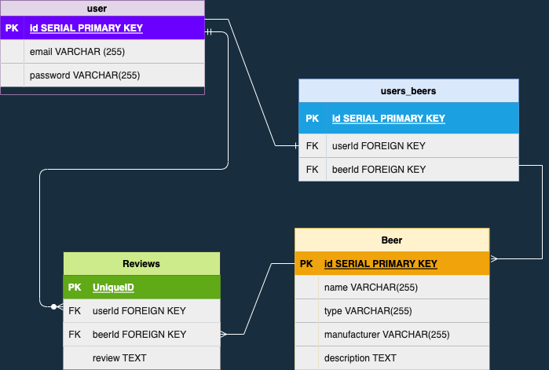

# Beer House
GA- SEI Project 2
## Why I chose this project.
For my second GA Project, I decided to build a fullstack app that tracks the artisan beers the user has tried. The inspiration behind the app goes back to my experience as a chef where after every busy shift, employees share a few pints of beer while cleaning the kitchen to reward ourselves for our hard work. 

# Deployed Link: 
[Beer-House](https://beer-house.herokuapp.com/)

# Routes
| Method | Path | Purpose |
| ------ | -------------- | -------------------------------- |
| GET | / | Landing Page | Shows a carousel of beer photos.
| GET | /logout | Logout Page | Logs user out.
| POST | /users/new | Sign up page and redirect to login page. |
| POST | /users/login | login page and redirect to tracker page. |
| GET | /users/tracker | shows the user's tracker list |
| GET | /users/tracker/:beerName | shows beer details in the tracker list. |
| POST |/users/tracker/:beerName/review | Review form page for tracked beer. |
| DELETE |/users/tracker/reviews/:id | Deletes chosen review. |
| GET |/users/tracker/reviews/edit/:id | Gets reviews to edit. |
| PUT | /users/tracker/reviews/:id | Updates the chosen review. |ß
| PUT | /users/tracker/:id | Updates the chosen beer. |
| DELETE | /users/tracker/:name | Deletes the chosen beer. |
| GET | /beers | display beer list, including search bar and function |
| GET | /beers/:name | shows untracked beer's details |
| GET | /beers/random| generates random beer |

## As a user, I want to be able to:
1. Search different beers and read their description.
2. Track the beer I have tried and rate them.
3. Make a review of the beer that I tried.

## MVP 
1. Fetch from punk api.
2. Display and search data.
3. Add beer to tracker list.
    In the tracker list:
        a. Delete a beer from the list.
        b. Update the added beer.
        c. Click on a beer and show the details.
4. In show.ejs, render the following:
        a. name
        b. user review
        c. description
        d. Yeast type

5. Sign up, Log in where user can only access their own beer tracker.

## STRETCH GOALS
1. Make a trending beer page where you can upvote and downvote beers.

## ERDS

## WIREFRAME 

## TECH STACK AND API:
I plan on using Express, Node, Postgresql, EJS, Bootstrap/ Other CSS Frameworks to build the app, and [Punk API](https://punkapi.com) for the beer database.

# How to run this locally:
1. Fork this repo.
2. Clone your forked repo. (Make sure you are cloning your own fork of this repo, and not this repo.)
3. npm install (to intall all dependencies)
4. nodemon index.js
5. visit localhost:8080 to check your running app.

### Sources

[Punk API](https://punkapi.com)
[Bootswatch](https://bootswatch.com)
[Google Images](https://google.com)
[Flaticons](https://www.flaticon.com/)
[Bootstrap](https://www.getbootstrap.com/)

